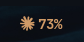
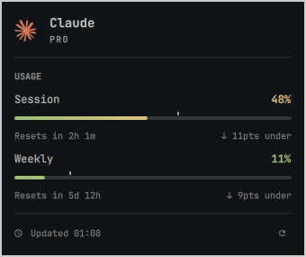
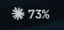
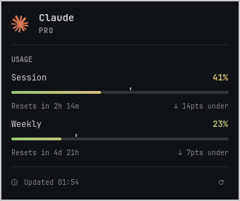
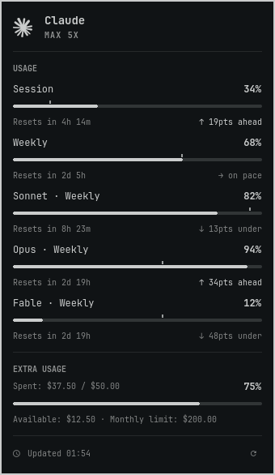
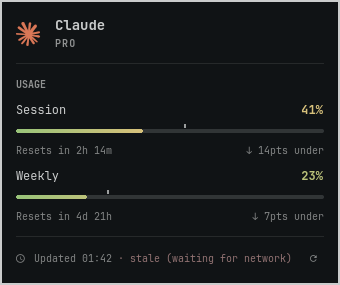
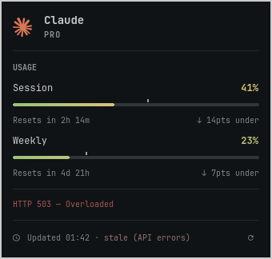
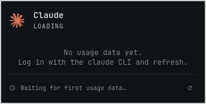
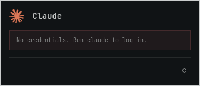
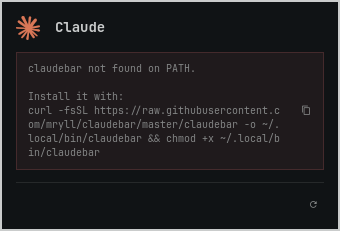

# claudebar for GNOME

A GNOME X11 frontend for [claudebar](https://github.com/mryll/claudebar) by mryll: it shows how much of your Claude AI plan you have used, in the GNOME taskbar.

> [!NOTE]
> **This is a wrapper, not a new implementation.** All the usage data comes from the original [`claudebar` CLI](https://github.com/mryll/claudebar): it reads your Claude credentials, calls the usage API, caches the answer, and works out the limits, the pace and the color gauge. claudebar ships frontends for Waybar and for the Omarchy shell, which run on Wayland. This project brings the Omarchy shell panel to a GNOME desktop on X11, such as Zorin OS or Ubuntu on Xorg.

The taskbar shows the Claude glyph and a short usage percentage:

<p align="center">
  
</p>

A click opens a card with one section for each limit: the session limit, the weekly limit and the per-model limits, each with a progress bar, a color for the level of use, and the time until it resets.

<p align="center">
  
</p>

## Contents

- [What comes from where](#what-comes-from-where)
- [Features](#features)
- [Screenshots](#screenshots)
- [Requirements](#requirements)
- [Installation](#installation)
- [Usage](#usage)
- [Configuration](#configuration)
- [How it works](#how-it-works)
- [Troubleshooting](#troubleshooting)
- [Uninstall](#uninstall)
- [Tests](#tests)
- [Credits](#credits)

## What comes from where

| Part | Source |
|---|---|
| Usage data: credentials, token refresh, API calls, cache, rate-limit handling, limits, pace, extra usage, gauge thresholds and colors | The [`claudebar` CLI](https://github.com/mryll/claudebar), unchanged. The widget runs `claudebar --json`. |
| Card content and behavior: sections, animated meters, pace marker, freshness footer, taskbar label, alert dot and pause mark | Adapted from claudebar's Omarchy shell plugin (`omarchy/Panel.qml` and `omarchy/BarWidget.qml`) |
| Visual design of the card | The [Omarchy](https://github.com/basecamp/omarchy) shell |
| X11 popup window, GNOME Shell extension for the taskbar icon, JSON config, installer, screenshots and test suite | This project |

## Features

From the claudebar CLI:

- Session (5h) and weekly (7d) limits, each with a countdown to the reset.
- Per-model limits, such as a weekly limit for one model, when the API reports them.
- Extra usage: the money spent this month, the prepaid balance that is left, and the monthly limit.
- Pace indicators that compare your use with the time that has passed.
- A green-to-red color gauge with fixed thresholds.
- A 60-second cache, automatic token refresh, and cached data while the API or the network fails.

From the Omarchy plugin, ported to GNOME:

- A card with one animated meter per limit. Each meter paints the gauge along its length, and each number takes the color of the gauge at its own value.
- A pace marker on each meter, and a footer with the time of the last update and a refresh button.
- An alert dot on the taskbar icon when a limit that is *not* on the taskbar reaches 90% or more, with a tooltip that names it.
- A pause mark on the taskbar icon while the widget shows cached data.

Added by this project:

- The GNOME taskbar icon, with the taskbar at the top or at the bottom of the screen.
- Keyboard control in the card, and IPC for keybinds and scripts.
- One JSON config for behavior, colors, fonts, sizes, corner radius and border, reloaded live.
- An installer that also removes everything it added.

## Screenshots

The icon in the GNOME taskbar. The glyph and the percentage take the gauge color of the value they show, or the text color in monochrome:

| Colors | Monochrome (`"colors": "none"`) |
| :---: | :---: |
|  |  |

The card screenshots below come from `screenshots/generate.sh`: the real widget and the real `claudebar` CLI, with fake credentials and a fake API response. The taskbar screenshots are taken by hand, because the GNOME Shell extension only draws inside GNOME Shell.

| Max plan | Pro plan | Monochrome (`"colors": "none"`) |
| :---: | :---: | :---: |
|  |  |  |

When something goes wrong, the widget keeps the last good data on screen and says why:

| Network down: cached data | API error: cached data | Waiting for the first data |
| :---: | :---: | :---: |
|  |  |  |

| Not logged in | claudebar CLI missing |
| :---: | :---: |
|  |  |

To make them again, for example after a change to the card:

```bash
screenshots/generate.sh
```

It needs `qs` and the `claudebar` CLI on your `PATH`, and uses the fonts you have installed.

## Requirements

- GNOME Shell on **X11**. GNOME on Wayland does not let Quickshell place the card over other windows.
- [Quickshell](https://quickshell.org/docs/guide/install-setup/) 0.3 or later, with X11 support (the default build).
- [Claude CLI](https://github.com/anthropics/claude-code). You must be logged in with the `claude` command.
- A Claude Pro or Max subscription.
- `curl`, `jq`, `python3`, `unzip` and GNU `date`. These are standard on most Linux systems.
- A [Nerd Font](https://www.nerdfonts.com/) for the footer and button glyphs. The default is JetBrainsMono Nerd Font.
- Optional: `xclip`, for the button that copies the CLI install command.

The installer also installs these two, if they are missing:

- The [`claudebar` CLI](https://github.com/mryll/claudebar), into `~/.local/bin`. You can also install it yourself, for example from the AUR or with `make install`, as its README describes.
- [Font Awesome](https://fontawesome.com/) 7 Brands, for the Claude glyph, into `~/.local/share/fonts/claudebar`.

## Installation

```bash
git clone https://github.com/hiroshimorowaka/claudebar.git
cd claudebar
./install.sh
```

The installer:

1. Checks the requirements, and installs the `claudebar` CLI and the Font Awesome Brands font if they are missing.
2. Copies `quickshell/` to `~/.local/share/claudebar/quickshell` and `gnome-extension/` to `~/.local/share/gnome-shell/extensions/claudebar@hiroshi`. An older install in `~/.config/quickshell/claudebar` is moved there.
3. Copies itself to `~/.local/share/claudebar/uninstall.sh`, so you can uninstall without the repository.
4. Creates `~/.config/claudebar/config.json` from `config.example.json`. It never replaces a config that exists.
5. Starts the widget and adds `~/.config/autostart/claudebar.desktop`, so it starts with your session.
6. Enables the GNOME extension.

The widget does not need the repository after the install. You can keep the clone, or delete it.

The installer records what it adds that was not on your computer before, in `~/.local/state/claudebar/installed`: the `claudebar` CLI, the font, and each directory it creates. The uninstall uses that list.

To update, run the installer again from a new clone, or from your clone after a `git pull`. It replaces the widget and the extension with the new files, and keeps your config.

GNOME Shell loads a new extension only after a restart. Press `Alt+F2`, type `r` and press `Enter`. Your windows stay open.

## Usage

| Control | Result |
|---|---|
| Left click on the icon | Open or close the card |
| Middle click on the icon | Get new data now. This ignores the 60-second cache of the CLI. |
| Right click on the icon | Open the claude.ai usage page |
| `r`, `Enter` or `Space`, in the card | Get new data now |
| `Esc`, or a click outside the card | Close the card |
| `Up` / `Down` or `k` / `j`, in the card | Scroll, when the card is taller than the screen |

The footer of the card shows the time of the last update and a refresh button (󰑐). The button stays disabled while a fetch runs.

The widget answers IPC, so a GNOME custom shortcut or a script can drive it:

```bash
qs -p ~/.local/share/claudebar/quickshell ipc call claudebar refresh   # fetch now
qs -p ~/.local/share/claudebar/quickshell ipc call claudebar close     # close the card
```

`toggleAt <x> <edge> <size> <top|bottom>` opens the card at a position on the screen. The extension calls it with the icon position.

## Configuration

Edit `~/.config/claudebar/config.json`. The widget reloads it when you save. A key that is missing takes its default value.

```json
{
  "refreshIntervalSec": 300,
  "barWindow": "session",
  "showLabel": true,
  "colors": "full",

  "style": {
    "fontFamily": "JetBrainsMono Nerd Font",
    "fontSize": 12,
    "width": 340,
    "padding": 14,
    "gap": 5,
    "radius": 0,
    "borderWidth": 2,
    "border": "#cacccc",
    "background": "#101315",
    "backgroundOpacity": 1.0,
    "foreground": "#cacccc",
    "urgent": "#a55555",
    "brand": "#d97757"
  },

  "gauge": {
    "low": "#98c379",
    "mid": "#e5c07b",
    "high": "#d19a66",
    "critical": "#e06c75"
  }
}
```

### Behavior

| Key | Type | Default | Description |
|---|---|---|---|
| `refreshIntervalSec` | integer (60 or more) | `300` | How often to run `claudebar`. The CLI keeps the API response in its cache for 60 seconds. A value of less than 300 can cause API rate limits. Opening the card always gets new data. |
| `barWindow` | `session` \| `weekly` | `session` | The limit that gives the percentage on the taskbar. Other limits still reach you through the alert dot and the card. |
| `showLabel` | boolean | `true` | Show the usage percentage next to the icon. |
| `colors` | `full` \| `none` \| `bar-only` \| `panel-only` | `full` | Where color is used. A monochrome surface uses only foreground tones. The numbers and the marks continue to show the level. |

### Style

| Key | Default | Description |
|---|---|---|
| `fontFamily` | `JetBrainsMono Nerd Font` | Font of the card, the taskbar label and the tooltip. Use a Nerd Font, for the glyphs. |
| `fontSize` | `12` | Base font size in pixels. Every other size and space in the card scales with it. |
| `width` | `340` | Width of the card, at a font size of 12. |
| `padding` | `14` | Space inside the card border, at a font size of 12. |
| `gap` | `5` | Space between the card and the taskbar or the screen edge, at a font size of 12. |
| `radius` | `0` | Corner radius of the card, the buttons and the tooltips, in pixels. |
| `borderWidth` | `2` | Width of the card border, in pixels. `0` removes the border. |
| `border` | `#cacccc` | Color of the card border. |
| `background` | `#101315` | Background of the card and the tooltips. |
| `backgroundOpacity` | `1.0` | Opacity of the card background, from `0` to `1`. |
| `foreground` | `#cacccc` | Text color. The dim texts, the separators and the meter tracks derive from it. |
| `urgent` | `#a55555` | Color of errors and of a pace that is much too fast. |
| `brand` | `#d97757` | Color of the Claude glyph in the card. |

### Gauge

The four colors of the meter gauge: `low` at 0%, `mid` at 50%, `high` at 75% and `critical` at 90% and above. A percentage between two of these takes a color between them. The widget passes these colors to the CLI with its `--color-low`, `--color-mid`, `--color-high` and `--color-critical` options, and the CLI sends back the gauge stops, so the thresholds stay the CLI's.

## How it works

1. The `claudebar` CLI reads the OAuth credentials from `~/.claude/.credentials.json`, refreshes the token when it is about to expire, and calls `api.anthropic.com/api/oauth/usage`. Refer to the [claudebar README](https://github.com/mryll/claudebar#how-it-works) for the details, the cache and the rate limits.
2. The widget runs `claudebar --json` in Quickshell at each refresh, and draws the card from the structured output of the CLI.
3. The widget writes what the taskbar icon shows, the label, the colors, the marks and the tooltip, to `$XDG_RUNTIME_DIR/claudebar.json`.
4. The GNOME extension watches that file, draws the icon, and calls the widget IPC when you click.

```
quickshell/
  shell.qml       entry point: IPC and the state for the taskbar icon
  Theme.qml       reads the config
  Usage.qml       runs the claudebar CLI and builds the model: windows, gauge, pace, freshness
  Panel.qml       content of the card
  Card.qml        the card surface
  Popup.qml       the X11 window that holds the card next to the icon
  IconButton.qml  small glyph button with a tooltip
gnome-extension/  the taskbar icon
install.sh        install, update and uninstall
screenshots/      the screenshots and generate.sh, which makes them
tests/            test suite, see Tests
```

> [!WARNING]
> The OAuth usage endpoint is not documented and has strict rate limits. An interval of less than 300 seconds will usually cause HTTP 429 errors. If this occurs, the widget shows the data from the cache with a pause mark. Refer to [claude-code#30930](https://github.com/anthropics/claude-code/issues/30930).

## Troubleshooting

| You see | Meaning | What to do |
|---|---|---|
| A dim icon with no percentage | The widget is getting the first data | This is normal at start. The data appears at the next refresh. |
| A pause mark after the percentage | Old data. The API applied a rate limit, or the network is down. | The widget shows the data from the cache. This corrects itself. |
| "Log in with the claude CLI" in the card | No credentials | Run `claude` to log in |
| An HTTP error at the bottom of the card | API error behind data that is still usable | Examine your internet connection. A 4xx error usually needs a new login. |
| "claudebar not found on PATH" in the card | The CLI is not installed | Run `./install.sh` again, or copy the command with the button in the card |
| No icon in the taskbar | The extension is not loaded | Restart GNOME Shell with `Alt+F2`, `r`. Then run `gnome-extensions info claudebar@hiroshi`. |
| The icon does nothing on click | The widget is not running | Run `qs -p ~/.local/share/claudebar/quickshell -d` |

**The card ignores my keyboard.** Click once inside the card, then use the keys.

**The Claude glyph is a box.** Run `fc-list | grep "Font Awesome 7 Brands"`. If it prints nothing, run `./install.sh` again.

**The numbers look wrong.** Run `claudebar --json` in a terminal. The card only draws what the CLI prints, so a problem there belongs to the [claudebar CLI](https://github.com/mryll/claudebar), and its troubleshooting section can help.

**The widget logs.** Run `qs -p ~/.local/share/claudebar/quickshell log`.

## Uninstall

```bash
~/.local/share/claudebar/uninstall.sh
```

If you kept the clone, `./install.sh --uninstall` does the same. This removes everything that this project put on your computer:

- The widget process, and the extension from the GNOME enabled and disabled extension lists.
- The widget and the uninstaller in `~/.local/share/claudebar`, and the extension in `~/.local/share/gnome-shell/extensions/claudebar@hiroshi`.
- The autostart entry, your config in `~/.config/claudebar`, the `claudebar` CLI cache in `~/.cache/claudebar`, the state in `~/.local/state/claudebar` and `$XDG_RUNTIME_DIR/claudebar.json`.
- The `claudebar` CLI and the Font Awesome Brands font, if the installer installed them.
- Each directory the installer created, when it is empty.

It keeps what was there before the install, such as a `claudebar` CLI or a Font Awesome font that you had already installed. It does not remove Quickshell, which you install yourself, or a clone of this repository that you kept.

## Tests

```bash
tests/run_all.sh
```

The suite runs in about 15 seconds and never touches your real desktop. Each test runs in a temporary `HOME` with every XDG directory inside it, and a stub takes the place of the network, GNOME, fontconfig and Quickshell where a test does not need the real program.

| File | What it checks |
|---|---|
| `tests/test_cli_contract.sh` | Runs the `claudebar` CLI on your `PATH` with crafted credentials and a cached API response, and checks every `--json` field the widget reads: windows, pace, palette, extra usage, stale data, API errors, loading and a missing login. Run it after you update the CLI. |
| `tests/test_widget.sh` | Runs `Usage.qml` and `Panel.qml` headless in Quickshell (`QT_QPA_PLATFORM=offscreen`) against the fixtures in `tests/fixtures`, with a fake CLI. Checks the taskbar label, color and alert dot, the gauge, the pace and money texts, every config option and its defaults, stale data, errors, and a missing CLI. |
| `tests/test_install.sh` | Runs `install.sh` in a temporary `HOME` with stubs for GNOME, Quickshell, fontconfig and downloads. Checks the copied files, the config, the autostart entry, the extension lists, an update, an install from a clone that is deleted afterwards, and that the uninstaller leaves `HOME` exactly as it was before the install. |
| `tests/run_all.sh` | Runs the three files above, then lint: bash syntax, `shellcheck`, `extension.js` syntax with `node`, QML syntax with `qmlformat`, valid JSON, and that the widget, the extension and the installer use the same names. A lint check is skipped when its tool is not installed. |

The suite needs `qs`, the `claudebar` CLI, `jq` and `python3`.

## Credits

- **[claudebar](https://github.com/mryll/claudebar) by mryll.** The CLI that does all the data work of this widget, and the Omarchy shell plugin that the card and the taskbar icon are adapted from. If this widget is useful to you, the credit belongs there first.
- **[Omarchy](https://github.com/basecamp/omarchy).** The visual design of the card and its components.
- **[Quickshell](https://quickshell.org).** The QML toolkit the card runs on.

claudebar and Omarchy use the MIT license. This project keeps their copyright notices in [LICENSE](LICENSE).
